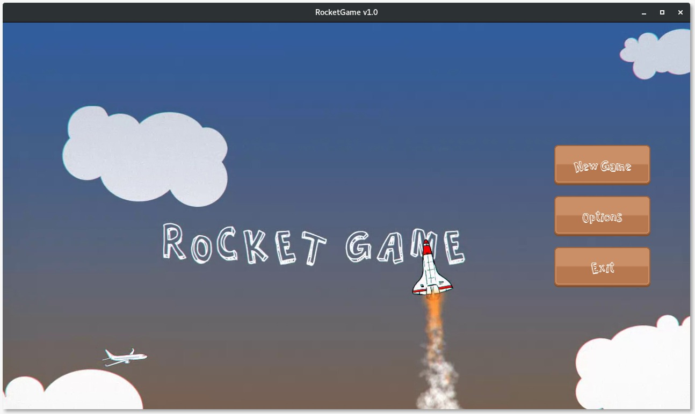
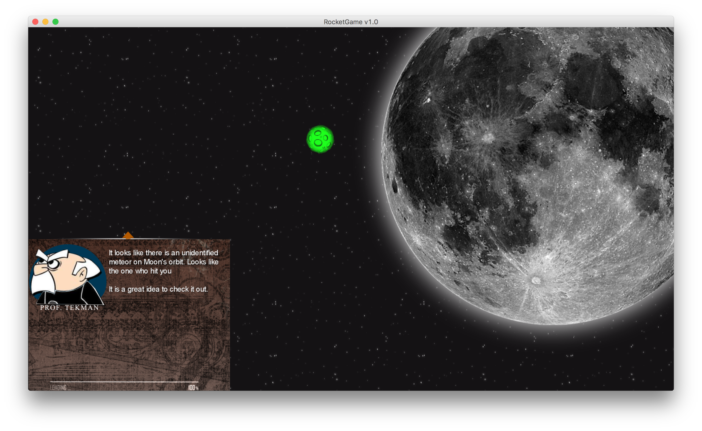
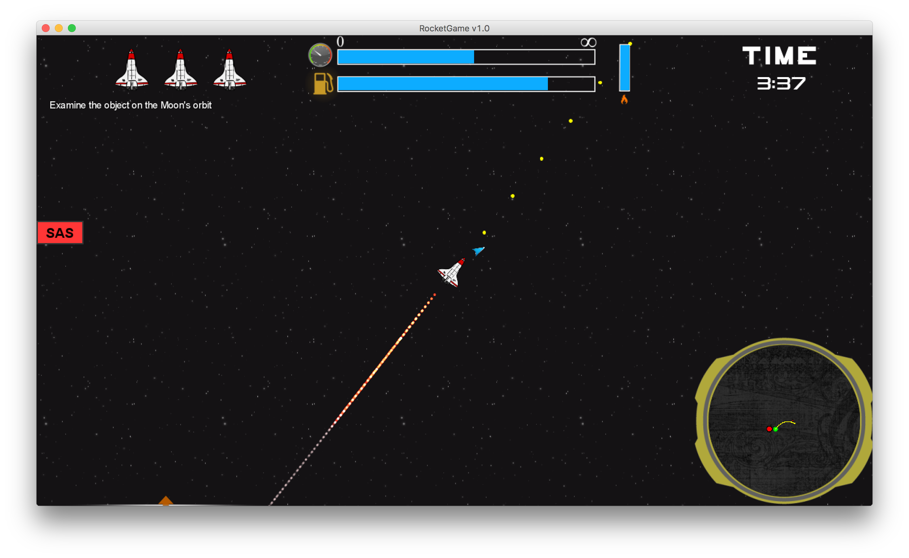
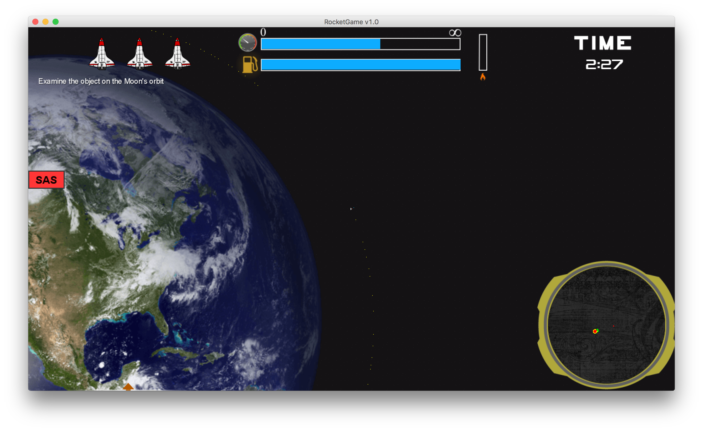
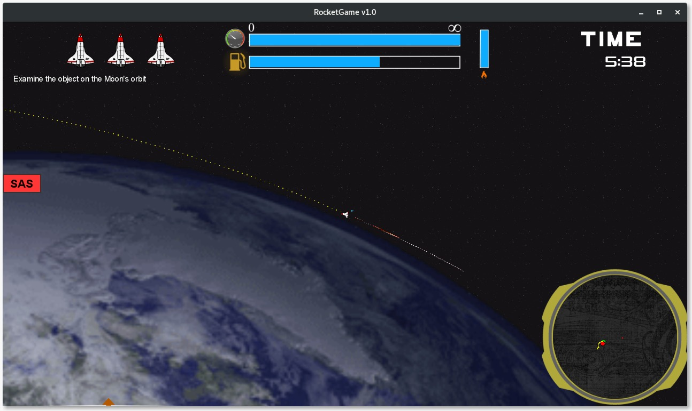
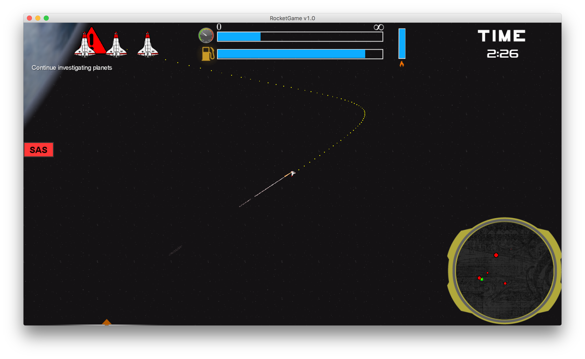
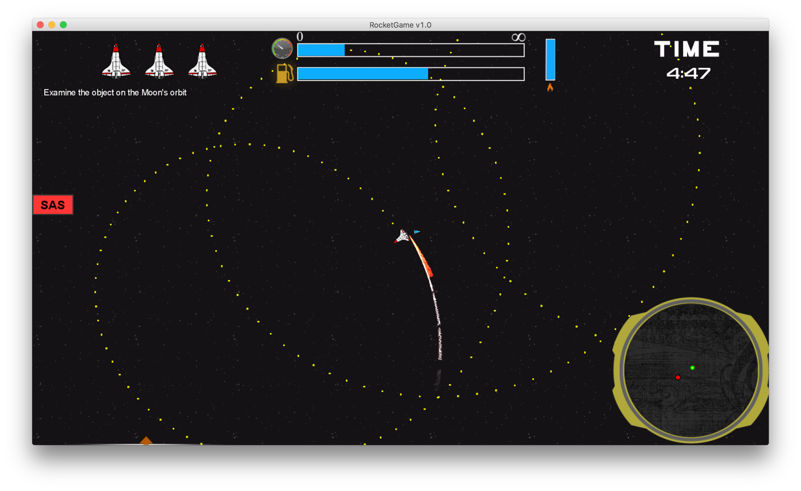

#RocketGame 

This is a computer game that is created with the aim of making various principles of space travel, such as orbital mechanics, easy to understand for a general audience in an entertaining way. The game is primarily about piloting a rocket from one location to another in a two-dimensional space environment with realistic gravitation but reduced distances while managing additional concerns like fuel consumption and avoiding obstacles.

Implemented in Java as a group project for Bilkent University CS-102 course, got 10/10 on demo.

###Libraries Used
- LibGDX (with gdx-video plugin)
- Box2D

### [Demo (in Turkish)](https://www.youtube.com/watch?v=31m7LLYHFeE)

###Screenshots

